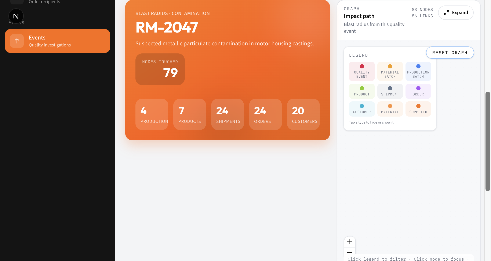
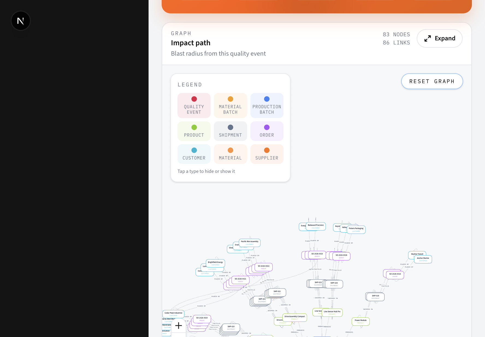
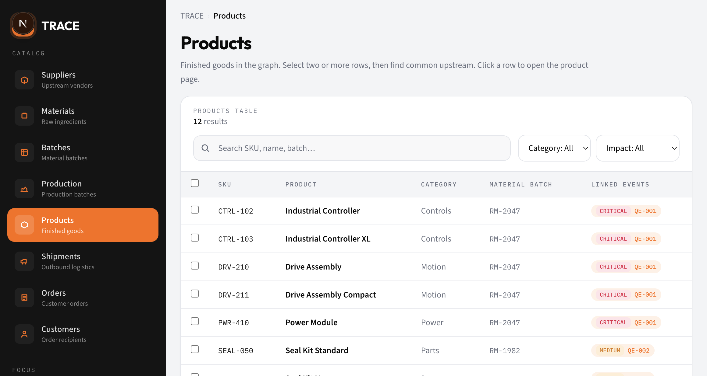

# TRACE

Product recall & supply-chain investigation app backed by **CognoDB** (openCypher over Bolt).

When a material batch is compromised, TRACE walks the graph to answer: what production ran, which products shipped, which orders and customers are in the blast radius — and what do multiple affected items share upstream.

**Hero demo path:** quality event **QE-001** → contaminated batch **RM-2047**.

## Demo

| | |
| --- | --- |
| **Hosted app** | _Add your Vercel (or other) URL here after deploy_ |
| **Screen recording** | _Add a short Loom / video link here_ |
| **Local** | [http://localhost:3000](http://localhost:3000) after setup below |

Keep your CognoDB free instance running until reviewers finish evaluating the submission.

## Why a graph database?

Supply-chain recall is a **path and shared-ancestor** problem, not a row lookup.

| Question | Why graphs fit |
| --- | --- |
| Blast radius of a contaminated batch | Multi-hop traversal: batch → production → product → shipment → order → customer |
| Where did this product come from? | Reverse path to material + supplier |
| What do these SKUs / shipments share? | Intersection of upstream neighborhoods — awkward as recursive joins in SQL |

In a relational schema you would need many junction tables and recursive CTEs (or denormalized “impact” tables that go stale). In a graph, those questions are typed relationships and parameterized path queries — the same model the UI visualizes.

## Stack

- **Next.js** (App Router) + TypeScript + Tailwind
- **CognoDB** via the official **Neo4j JavaScript driver** (`neo4j-driver`)
- **React Flow** for impact / neighborhood graphs
- Seed script: `npm run seed` (`scripts/seed.ts`)

## Data model

```text
Supplier -[:SUPPLIES]-> Material -[:HAS_BATCH]-> MaterialBatch
  -[:USED_IN]-> ProductionBatch -[:PRODUCES]-> Product
  -[:SHIPPED_IN]-> Shipment -[:FULFILLS]-> Order -[:PLACED_BY]-> Customer

QualityEvent -[:AFFECTS]-> MaterialBatch
```

Labeled nodes, typed relationships, properties on events (severity, status), batches (batch numbers, dates), and commercial entities (SKU, region, etc.). Constraints are created in the seed script; `cypher/schema.cypher` documents the model and wipe query.

## Screenshots

### Quality events & investigation



Open **QE-001** to see blast-radius counts (production, products, shipments, orders, customers) beside the impact-path graph.

### Impact path graph



React Flow visualization of the blast radius. Use the legend card to show/hide node types; expand for a larger canvas.

### Catalog + common upstream



On any catalog table, select **two or more** rows and use **Find common upstream** to see shared ancestors in a modal.

## Setup

### 1. Create a CognoDB Cloud instance

1. Sign up at [https://console.cognodb.com/signup](https://console.cognodb.com/signup) (free tier, no card).
2. Create a free (**c0**) instance and pick a region.
3. Copy the Bolt URI (`bolt+s://<instance-id>.databases.cognodb.cloud`) and the one-time password for user `cognodb`.

### 2. Configure environment

```bash
cp .env.example .env.local
```

```env
COGNODB_URI=bolt+s://<instance-id>.databases.cognodb.cloud
COGNODB_USERNAME=cognodb
COGNODB_PASSWORD=<secret>
```

Never commit `.env.local` — secrets stay in env vars only.

### 3. Install, seed, run

```bash
npm install
npm run seed
npm run dev
```

Open [http://localhost:3000](http://localhost:3000). Prefer starting with **Events → QE-001**.

### Scripts

| Command | Purpose |
| --- | --- |
| `npm run dev` | Local app |
| `npm run seed` | Wipe + load demo graph (includes QE-001 → RM-2047) |
| `npm run build` | Production build |
| `npm run lint` | ESLint |

### Deploy (optional but recommended)

Deploy to Vercel (or similar), set the same `COGNODB_*` env vars in the host, run seed once against your instance, and paste the public URL into the **Demo** section above.

## Main queries

All Cypher lives in `src/lib/queries.ts` and runs parameterized through the Neo4j driver (no string-concatenated user input). UI talks only to Next.js API routes; `db.ts` / `catalog.ts` / `investigations.ts` are `server-only`.

### 1. Impact summary (multi-hop blast radius)

From a quality event, walk downstream and count distinct entities at each stage:

```cypher
MATCH (event:QualityEvent {id: $eventId})-[:AFFECTS]->(batch:MaterialBatch)
OPTIONAL MATCH (batch)-[:USED_IN]->(production:ProductionBatch)
OPTIONAL MATCH (production)-[:PRODUCES]->(product:Product)
OPTIONAL MATCH (product)-[:SHIPPED_IN]->(shipment:Shipment)
OPTIONAL MATCH (shipment)-[:FULFILLS]->(order:Order)
OPTIONAL MATCH (order)-[:PLACED_BY]->(customer:Customer)
RETURN
  count(DISTINCT production) AS productionBatches,
  count(DISTINCT product) AS products,
  count(DISTINCT shipment) AS shipments,
  count(DISTINCT order) AS orders,
  count(DISTINCT customer) AS customers
```

### 2. Impact graph paths

Collect upstream (supplier / material) and downstream paths for React Flow:

```cypher
MATCH (event:QualityEvent {id: $eventId})-[:AFFECTS]->(batch:MaterialBatch)
OPTIONAL MATCH upPath =
  (batch)<-[:HAS_BATCH]-(:Material)<-[:SUPPLIES]-(:Supplier)
OPTIONAL MATCH path =
  (batch)-[:USED_IN]->(:ProductionBatch)
  -[:PRODUCES]->(:Product)
  -[:SHIPPED_IN]->(:Shipment)
  -[:FULFILLS]->(:Order)
  -[:PLACED_BY]->(:Customer)
...
```

### 3. Reverse trace (product → supplier)

```cypher
MATCH (product:Product {id: $productId})
OPTIONAL MATCH path =
  (product)
  <-[:PRODUCES]-(:ProductionBatch)
  <-[:USED_IN]-(:MaterialBatch)
  <-[:HAS_BATCH]-(:Material)
  <-[:SUPPLIES]-(:Supplier)
RETURN product, path
```

### 4. Common upstream (awkward in SQL)

Given several entities of the same type, find nodes that sit on a directed path to **all** of them — shared suppliers, batches, products, etc.:

```cypher
UNWIND $ids AS entityId
MATCH (n {id: entityId})
WHERE $label IN labels(n)
MATCH (common)-[:SUPPLIES|HAS_BATCH|USED_IN|PRODUCES|SHIPPED_IN|FULFILLS|PLACED_BY|AFFECTS*1..7]->(n)
WHERE NOT common.id IN $ids
WITH common, count(DISTINCT n) AS sharedBy
WHERE sharedBy = size($ids)
RETURN common, labels(common) AS labels, sharedBy
```

This is the query a relational schema finds painful: recursive ancestry per row, then intersection. Exposed in the UI as **Find common upstream** on catalog tables.

## App features

- Investigation workspace: severity-ranked events, blast-radius hero, stage breakdown, React Flow impact graph (legend filters, expand modal)
- Catalog browse for suppliers → customers with search, filters, pagination
- Entity detail pages with neighborhood graphs and linked events
- Reverse “Trace upstream” on products in the investigation panel
- Multi-select common upstream across catalog tables
- Graceful DB errors (503 + retry) when CognoDB is unreachable

## Project layout

```text
src/app/              # App Router pages + API routes
src/components/       # Dashboard, graph, tables
src/lib/              # db, queries, investigations, catalog
scripts/seed.ts       # Demo graph + constraints
cypher/schema.cypher  # Model notes + wipe
docs/screenshots/     # README images
```

## Notes

- All Cypher uses parameters — never string-concatenated user input.
- Connection details come only from environment variables.
- Seed always recreates the QE-001 → RM-2047 impact path for demos.
